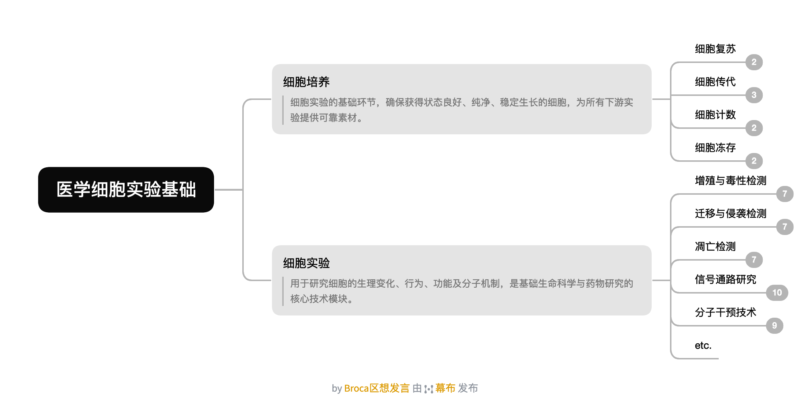

# 🧠 思维导图辅助理解

同时附上[完整思维导图](flowchart_and_mindmap/cell_experiments_mindmap.png)，搭配学习更佳~

---
# 1. 一些细胞实验的基础理论知识

正式开展细胞实验前，先对细胞实验的基本概念和常见技术形成一个整体认识。以下视频不涉及具体操作，偏重理论。

[【临床医生做基础科研——15.细胞实验相关基础知识】](https://www.bilibili.com/video/BV1UZ4y1U7Cp)——13min

---
# 2. 实操前的操作理论知识

## 2.1 细胞房规范与培养方法

进入细胞房前需掌握规范操作。无菌操作是细胞实验的核心前提，污染一旦发生，所有实验都得重来。
[【［科研分享］细胞实验基础/科研小白必备/医学实验之细胞房的使用规范与细胞培养常用方法】](https://www.bilibili.com/video/BV17u4y1a775)——20min

[【无菌操作的注意事项（1）】](https://www.bilibili.com/video/BV1kx4y1o7WL)

[【无菌操作的注意事项（2）】](https://www.bilibili.com/video/BV1mP41167Ys)
- 无菌操作的基本原则，该 up 主系列视频质量不错，可适当拓展
[【何时用瓶皿培养，何时用孔板培养】](https://www.bilibili.com/video/BV1v8411D7bc)
- 培养瓶/皿与孔板的选择依据，关键的理论补充

---
# 3. 一些基础细胞培养操作演示（按照实验的先后顺序排列）

## 3.1 细胞复苏

从液氮或 -80°C 取出冻存细胞后需快速解冻。解冻速度过慢会导致 DMSO 对细胞造成损伤，因此整个过程应尽量迅速。
[【浙大学姐手把手教你复苏细胞-超详细版🧪】](https://www.bilibili.com/video/BV1cRrcYnEzq)

[【实验小白来看✅细胞复苏视频版】](https://www.bilibili.com/video/BV1r3aPzVE8W)

## 3.2 细胞传代（可以优先看这部分，有一些泛用性的基本操作实操指导）

当细胞生长至一定密度后需要传代，否则会因接触抑制而死亡。这是细胞培养中最基础、最频繁的操作。

### 3.2.1 贴壁细胞、悬浮细胞——常用操作

[【浙大学姐手把手教你养细胞-超详细版】](https://www.bilibili.com/c/video/BV1c8CYYyEH6)

[【细胞传代步骤+注意事项✅长视频预警🔥】](https://www.bilibili.com/video/BV1hwfAYLEWt)

[【全网最细致教你细胞(第一集)：细胞传代(真实实验情况下)】](https://www.bilibili.com/video/BV1z5NfeKEmp)（但进出柜时建议严格酒精消毒）

### 3.2.2 贴壁细胞——细胞刮版本

部分细胞（如 RAW264.7）贴壁较紧，胰酶消化效果不佳，需使用细胞刮物理刮取。
[【RAW264.7细胞如何使用刮刀传代？】](https://www.bilibili.com/video/BV1ze4y1s7RP)

[【细胞刮收集贴壁细胞的操作及注意事项】](https://www.bilibili.com/video/BV1ZW4y147Zj)（非传代教学，可参考刮刀使用手法）

## 3.3 细胞计数（手动计数 + 细胞计数仪计数）

实验前需明确细胞悬液浓度，否则无法精准控制种板数量。手动计数使用血球计数板，也可直接使用计数仪。
[【不就是细胞计数嘛！师姐教你🧪】](https://www.bilibili.com/video/BV1D8rkYmEpw)

[【两种方法进行细胞计数✅视频版】](https://www.bilibili.com/video/BV1iSyJBoEA9)

## 3.4 孔板种植细胞

计数后按实验所需的密度将细胞接种至孔板。种板密度需根据细胞类型和实验目的优化——密度过高易导致细胞堆叠，过低则生长过慢。
[【浙大学姐手把手教你做细胞种板】](https://www.bilibili.com/video/BV1mKcBejE7J)

## 3.5 细胞冻存

多余的细胞或完成实验后的细胞可冻存以备后续使用。冻存液通常为血清加 DMSO，DMSO 的作用是防止冰晶形成损伤细胞。
[【浙大学姐手把手教你冻存细胞-超详细版🧪】](https://www.bilibili.com/video/BV1rh6UY7Ez9)

[【【干货分享-细胞冻存】快要放假啦！细胞怎么办？当然是冻存起来啦！】](https://www.bilibili.com/video/BV1ZK421y7rd)

---

# 4. 一些基础细胞实验操作演示（以下内容请根据实验需要选择学习）

## 4.1 细胞增殖与毒性检测

### 4.1.1 CCK-8 实验

CCK-8 是最常用的细胞增殖/毒性检测方法之一。其原理是试剂被活细胞线粒体中的脱氢酶还原为有色产物，颜色深浅与活细胞数量成正比。操作相对简单，但具体步骤需结合药物干预方案调整。
[【大家千呼万唤的CCK8超详细教程终于来啦！】](https://www.bilibili.com/video/BV12AQgYGE8J)（结合药物干预实操）

[【【实验室日常】导师当院士这事需要每天努力！| CCK8检测细胞活力】](https://www.bilibili.com/video/BV1Ya411g7fG)（真实实验操作）
[【细胞功能实验合集（5）：CCK8增殖实验 上篇 实验步骤及常见问题】](https://www.bilibili.com/video/BV1ch4y1R7GL)

[【细胞功能实验合集（6）：CCK8增殖实验 下篇 数据结果作图-折线图与IC50拟合曲线】](https://www.bilibili.com/video/BV1Qh411T7Wp)（实验操作和数据处理均有）

## 4.2 细胞迁移与侵袭能力检测

### 4.2.1 细胞划痕实验

在融合的单层细胞上制造一道划痕，观察细胞向划痕区域的迁移速度，用以评价细胞的迁移能力。操作简单，但结果分析的标准化需要注意。
[【细胞功能实验合集（3）：细胞划痕实验 上篇 实验步骤及常见问题】](https://www.bilibili.com/video/BV1pX4y1m7K4)

[【细胞功能实验合集（4）：细胞划痕实验 下篇 实验结果统计-宽度法及面积法】](https://www.bilibili.com/video/BV1Sh4y1s7jo)（该 up 主系列质量上等，评论区交流充分）

### 4.2.2 Transwell 实验

利用嵌套小室测定细胞的迁移或侵袭能力。上室接种细胞，下室加入趋化因子，通过计数穿过聚碳酸酯膜的细胞量来评估。
[【细胞功能实验合集（1）：Transwell侵袭实验 上篇 实验步骤详解】](https://www.bilibili.com/video/BV1ph411379b)

[【细胞功能实验合集（2）：Transwell侵袭实验 下篇 ImageJ统计结果】](https://www.bilibili.com/video/BV1Fc411s7Qc)

[【Transwell | 细胞迁移的实验操作全过程具体演示】](https://www.bilibili.com/video/BV1KV4y1V7MP)

## 4.3 细胞凋亡检测

[【科研干货 | 一键入门细胞凋亡检测】](https://www.bilibili.com/video/BV1D8411U7pC)（凋亡基本理论和实验原理，适合入门）

### 4.3.1 流式细胞术 Annexin V-FITC/PI 双染法

Annexin V 标记早期凋亡，PI 标记晚期凋亡或坏死细胞，二者联合使用可区分凋亡分期。该检测需使用流式细胞仪，需额外学习相关操作。
[【睦科生物 | 细胞凋亡具体实验步骤与注意事项】](https://www.bilibili.com/video/BV1qT411G7P9)

[【A211 Annexin V-FITC PI凋亡检测实验操作演示】](https://www.bilibili.com/video/BV1fT411D7bX)

### 4.3.2 TUNEL 法

检测 DNA 断裂——细胞凋亡晚期的标志性事件。适用组织切片和细胞爬片两种样本类型。
[【A112 TUNEL细胞凋亡检测（细胞爬片样本）实验操作演示】](https://www.bilibili.com/video/BV1EY411r7a4)

## 4.4 信号通路 / 蛋白变化

### 4.4.1 qRT-PCR

基因表达定量的金标准。市售试剂盒已相当成熟，按说明书操作即可，但不同试剂盒间流程存在差异，需注意核对。
[【qRT-PCR最详细全流程！看完包会！】](https://www.bilibili.com/video/BV1QSDGYREEn)（竖版视频，文字略小）

[【qPCR数据处理及分析作图】](https://www.bilibili.com/video/BV1d54y1P7PC)（完整的数据分析方法）

### 4.4.x qPCR / 免疫荧光 / WB
暂未进行学习，后期拓展补充

## 4.5 分子操作类（干预 / 操纵）

### 4.5.x 转染 / 病毒感染（siRNA / shRNA / CRISPR / 质粒）
暂未进行学习，后期拓展补充

## 5. 原代细胞提取与培养

### 5.1 小鼠神经元原代细胞提取

原代细胞相比细胞系更接近体内生理状态。神经元提取的关键在于操作迅速、轻柔，同时培养皿的包被处理直接影响细胞的贴壁效率和存活率。
[【原代皮层海马神经元培养难在提取单细胞，重在包被一下床】](https://www.bilibili.com/video/BV1LJZyBhEbv/)

[【原代神经元细胞分离】](https://www.bilibili.com/video/BV1JZmSYPEQQ/)

[【科研第三弹：小鼠🐀神经元原代细胞的提取教学】](https://www.bilibili.com/video/BV1rpQ2YNEcd/)
