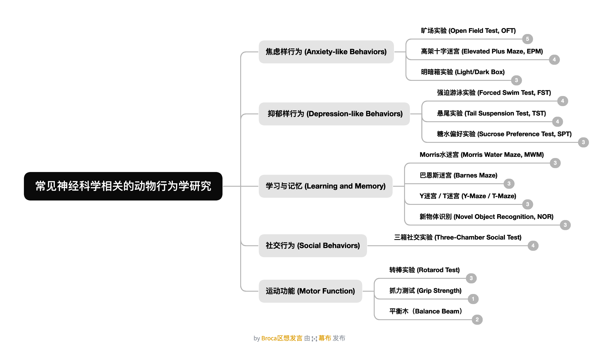

写在前面
---
- 动物行为学实验本身操作难度不大，但耗时长，且涉及多种数据分析软件
- 各实验室测量软件不同，有条件的实验室一般都有现成 protocol，提前自学以作了解即可
- 以下内容主要为视频和图文资料，便于建立对各类实验的直观认识，辅助课题设计和文献阅读
- ⭐⭐⭐ 标记为神经科学文献中较为常见的行为学实验

---
# 🧠 思维导图辅助理解

同时附上[完整思维导图](flowchart_and_mindmap/ethology_mindmap.png)，搭配学习更佳~

---
# 1. 焦虑样行为 (Anxiety-like Behaviors)

## 1.1 旷场实验 (Open Field Test, OFT) ⭐⭐⭐

将动物置于开阔环境，利用其趋暗避亮、趋边避中的天性来评价焦虑水平。在中央区域停留时间越长，提示焦虑水平越低；反之，长时间贴壁行走提示焦虑状态。
[【动物焦虑行为学实验-开场实验（旷场实验）】](https://www.bilibili.com/video/BV1Y8411D7FA)
[【旷场实验数据分析】](https://www.bilibili.com/video/BV1iSHYeNETF)（指标解读和理论基础）

## 1.2 高架十字迷宫 (Elevated Plus Maze, EPM) ⭐⭐⭐

十字形迷宫悬空架设，两条开臂和两条闭臂。动物在探索欲和恐惧之间的冲突决定其在开臂的探索时间——开臂停留时间越长，焦虑水平越低。
[【动物焦虑行为学实验-高架十字迷宫实验】](https://www.bilibili.com/video/BV1d8411273b)
[【动物行为学 高架十字迷宫教程 EPMT】](https://www.bilibili.com/video/BV14m4y1L7Br)

## 1.3 明暗箱实验 (Light/Dark Box)

利用动物趋暗避亮的天性。箱体分为明暗两个区域，记录动物在两侧的穿梭频率和在明侧的停留时间。
[浅析动物黑白箱/明暗箱（light/dark box）实验方法与注意事项](https://zhuanlan.zhihu.com/p/497567624)
[明暗箱实验 - 中国大百科全书](https://www.zgbk.com/ecph/words?SiteID=1&ID=69146&Type=bkzyb)

---
# 2. 抑郁样行为 (Depression-like Behaviors)

## 2.1 强迫游泳实验 (Forced Swim Test, FST)

将动物置于无法逃脱的水环境中，动物先挣扎后进入不动状态，反映行为绝望程度。抗抑郁药物可延长挣扎时间、缩短不动时间。该实验在抗抑郁药物筛选中广泛应用。
[【【研究生必备-10】强迫游泳实验视频+经验分享】](https://www.bilibili.com/video/BV167411b7XV)（附 PPT 讲解和 JoVE 原视频）
[【抑郁症-小鼠强迫游泳实验】](https://www.bilibili.com/video/BV1Sv411b7k4)（BGM 较欢快，注意音量）

## 2.2 悬尾实验 (Tail Suspension Test, TST)

原理与强迫游泳类似，将水面替换为悬吊。动物被悬吊后挣扎至放弃，记录不动时间作为抑郁指标。相比强迫游泳，排除了水环境本身可能带来的干扰因素。
[【《动物实验》行为学：悬尾实验】](https://www.bilibili.com/video/BV1TF411o7Kd)
[【抑郁症（三十三）抑郁症的动物模型（三）——悬尾实验TST】](https://www.bilibili.com/video/BV1NeqoYqEan)

## 2.3 糖水偏好实验 (Sucrose Preference Test, SPT) ⭐⭐⭐

快感缺失是抑郁症的核心症状之一。正常小鼠对糖水存在天然偏好，抑郁小鼠的糖水偏好率会显著降低。操作简便，是抑郁模型中使用率最高的行为学指标之一。
[【糖水偏好实验的步骤（含流程图）】](https://www.bilibili.com/video/BV18o4y1Z7W9)
[【小鼠糖水偏好实验】](https://www.bilibili.com/video/BV1QzWAejE5t)（均为理论知识）

---
# 3. 学习与记忆 (Learning and Memory)

## 3.1 Morris 水迷宫 (Morris Water Maze, MWM) ⭐⭐⭐

学习记忆领域最经典的行为学范式。动物在水池中寻找隐藏于水面下的平台，通过记录找到平台的潜伏期、路径长度、策略类型等指标评估空间学习和记忆能力。实验周期较长，通常连续测试 5-7 天。
[【【实验室日常】老鼠做得好导师当院士！｜morris水迷宫 | 小鼠行为学实验】](https://www.bilibili.com/video/BV1Pa4y1Q7kb)

## 3.2 巴恩斯迷宫 (Barnes Maze)

可理解为「干版水迷宫」。动物在多孔圆盘上寻找唯一的逃逸洞。由于驱动力（避光避噪）弱于水迷宫，部分小鼠可能探索动机不足，文献使用率相对水迷宫也低一些。
[浅析巴恩斯迷宫行为学测试原理及数据分析方法](https://www.bilibili.com/opus/784717549116850177)（未找到特别优质的视频）

## 3.3 Y 迷宫 / T 迷宫 (Y-Maze / T-Maze)

用于评估空间识别和工作记忆。Y 迷宫常通过自发交替行为来评价——小鼠天生倾向于探索之前未进入过的臂。
Y 迷宫：[【脑声课堂：大小鼠Y迷宫实验①】](https://www.bilibili.com/video/BV16x42117Zx)
T 迷宫：[【大小鼠T迷宫实验测试步骤】](https://www.bilibili.com/video/BV1yi421X7qE)

## 3.4 新物体识别 (Novel Object Recognition, NOR)

利用小鼠对新鲜事物的探索偏好。先让动物熟悉两个相同物体，之后替换其中之一，记录动物对新旧物体的探索时间差异。操作简便，无需训练。
[【【研究生必备-12】空间识别、新物体识别实验视频+经验分享】](https://www.bilibili.com/video/BV1T7411c7Qn)

---
# 4. 社交行为 (Social Behaviors)

## 4.1 三箱社交实验 (Three-Chamber Social Test) ⭐⭐⭐

评估小鼠社交能力和社交新颖性偏好。三箱中，一侧放置陌生小鼠，另一侧放置空笼或物体，记录目标小鼠在各侧的停留时间。在自闭症和精神分裂症动物模型研究中应用较广。
[【两分钟教你看懂三箱测试，原来老鼠也分社牛和社恐】](https://www.bilibili.com/video/BV1ZuGgzgEYn)
- 附 protocol：[10.1038/s41596-020-0382-9](https://pmc.ncbi.nlm.nih.gov/articles/PMC8103520/)

---
# 5. 运动功能 (Motor Function)

## 5.1 转棒实验 (Rotarod Test)

评估小鼠的运动协调和平衡能力。小鼠在加速转动的滚轴上行走，记录其跌落时间。常用于运动皮层或小脑相关疾病模型的研究。
[【动物行为学实验之小鼠转棒疲劳实验，评估小鼠的协调运动、平衡能力和运动耐力】](https://www.bilibili.com/video/BV12h4y1P7Gr)

## 5.2 抓力测试 (Grip Strength)

使用抓力计测量小鼠四肢的抓持力量，用于评估肌力变化。在肌无力模型或评估药物对肌肉功能影响的实验中较为常见。
[【大小鼠抓力测定仪操作视频】](https://www.bilibili.com/video/BV1hzEWzUEMU)
